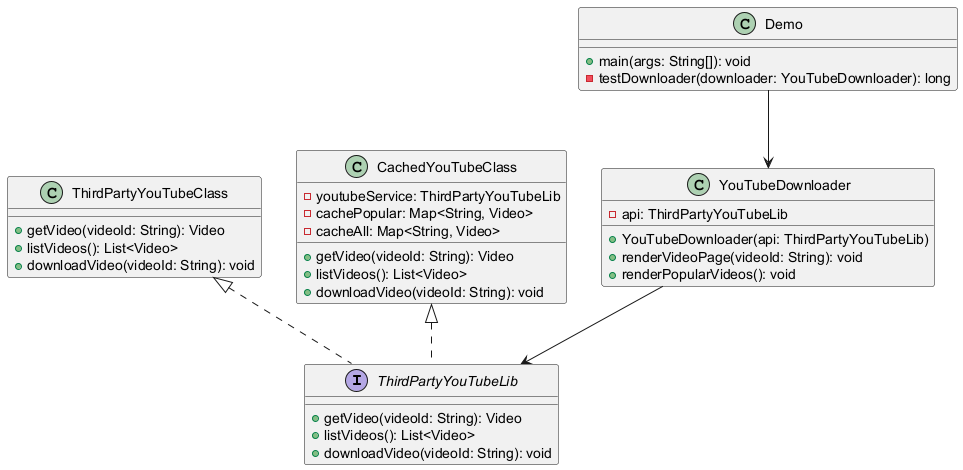

# 🎥 YouTube Downloader Proxy

- [Código](https://github.com/lipesshw/POO/tree/main/Desafios/Padr%C3%B5es%20de%20Projeto/padroesdeprojeto)
- [Funcionalidades](#-funcionalidades)
- [Tecnologias Utilizadas](#-tecnologias-utilizadas)
- [Como Executar](#-como-executar)

Este projeto é uma implementação do padrão de projeto Proxy para um downloader do YouTube. Ele utiliza uma biblioteca de mídia simulada para demonstrar como o proxy pode ser usado para cachear resultados e otimizar o desempenho.

## 💻 Funcionalidades

- **Cache de Resultados**: O proxy armazena em cache os resultados das operações custosas, como a busca e o download de vídeos.
- **Acesso Transparente**: O proxy fornece uma interface transparente ao cliente, funcionando como se o cliente estivesse interagindo diretamente com o objeto real.

## 🚀 Tecnologias Utilizadas

- **Java**: Linguagem de programação utilizada para desenvolver o sistema.


## 📈 Diagrama de Classes

<p align="center">
  
</p>

## 📖 Como Executar

1. **Clone o repositório**:
    ```bash
    $ git clone https://github.com/lipesshw/POO
    ```
2. **Navegue até o diretório do projeto**:
    ```bash
    $ cd POO/Desafios/Padrões de Projeto
    ```
3. **Compile o código**:
    ```bash
    $ javac ThirdPartyYouTubeLib.java ThirdPartyYouTubeClass.java Video.java CachedYouTubeClass.java YouTubeDownloader.java Demo.java
    ```
4. **Execute o programa**:
    ```bash
    $ java Demo
    ```

O programa exibirá uma série de operações, mostrando o comportamento com e sem o uso de cache, demonstrando a eficiência do padrão Proxy.
