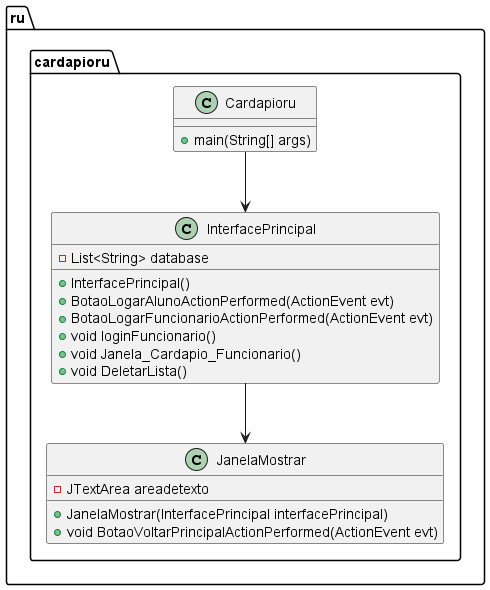

# ☕ Restaurante Universitário

- [Código](https://github.com/lipesshw/POO/tree/main/Desafios/Restaurante%20Universit%C3%A1rio/cardapioru)
- [Funcionalidades](#-funcionalidades)
- [Tecnologias Utilizadas](#-tecnologias-utilizadas)
- [Diagrama de Classes](#-diagrama-de-classes)

Este projeto é um sistema de gerenciamento de cardápios para o restaurante universitário. 
O sistema permite o cadastro, visualização e gerenciamento dos cardápios semanais, com interfaces diferenciadas para alunos e funcionários.

## 💻 Funcionalidades

- **Login para Funcionários**: Autenticação segura para acesso às funcionalidades de cadastro e gerenciamento de cardápios.
- **Visualização de Cardápios**: Alunos podem visualizar os cardápios cadastrados para a semana.
- **Cadastro de Cardápios**: Funcionários podem adicionar, editar e deletar cardápios.

## 🚀 Tecnologias Utilizadas

- **Java**: Linguagem de programação utilizada para desenvolver o sistema.
- **Swing**: Biblioteca gráfica utilizada para construir a interface do usuário.

  
## 📈 Diagrama de Classes

  

